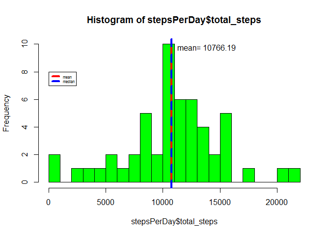
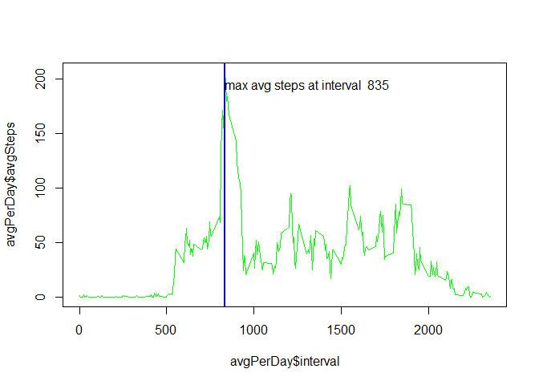
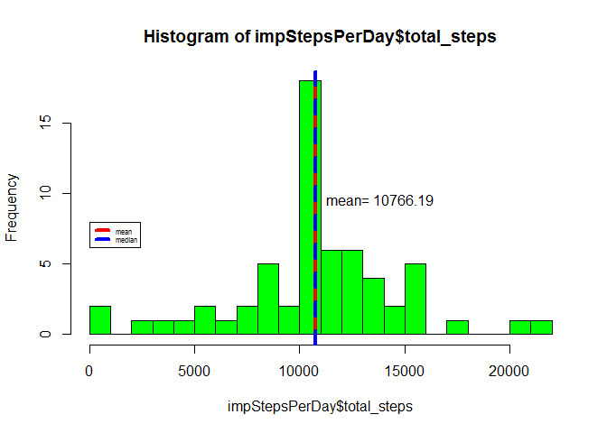
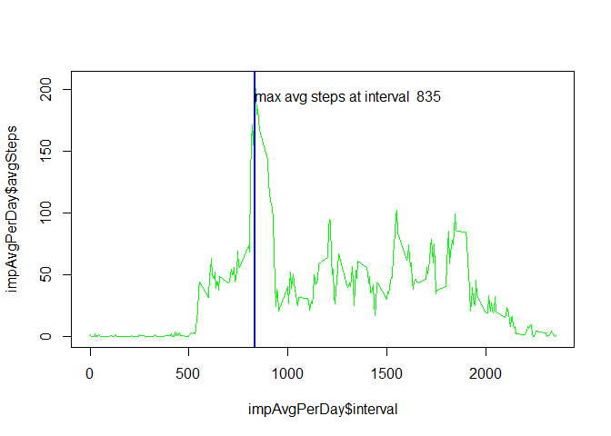
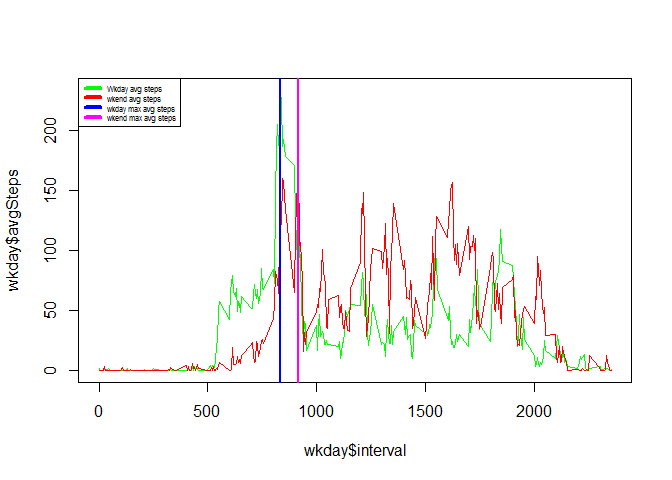
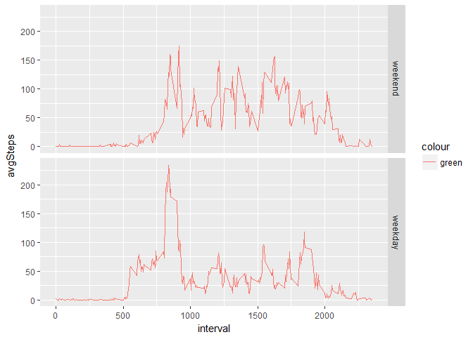

# Reproducible Research: Peer Assessment 1
Doug Moyer  
April 26, 2017  


## Loading and preprocessing the data

Add required variables for the data analysis.

```r
library(dplyr)
```

```
## 
## Attaching package: 'dplyr'
```

```
## The following objects are masked from 'package:stats':
## 
##     filter, lag
```

```
## The following objects are masked from 'package:base':
## 
##     intersect, setdiff, setequal, union
```

```r
steps <- read.csv("activity.csv")
steps <- mutate(steps, date=as.Date(date),
                weekday = factor((weekdays(date) 
                        %in% c('Saturday', 'Sunday')), 
                        levels=c(TRUE, FALSE), 
                        labels=c('weekend', 'weekday')),
                day = factor(date, labels = ''))
```


## What is mean total number of steps taken per day?

The mean number of steps taken is 10766. The mean and median are virtually the same value for this set of data as shown in the plot below.


```r
stepsPerDay <- steps %>% 
                group_by(date) %>%
                summarise(total_steps = sum(steps))
hist(stepsPerDay$total_steps, col = 'green', breaks=25)
mSteps <- mean(stepsPerDay$total_steps, na.rm = TRUE)
abline(v = mSteps, col = "red", lwd = 4)
text(mSteps, 10 , paste("mean=",round(mSteps, 2)), adj = c(-.1,1))
abline(v = median(stepsPerDay$total_steps, na.rm = TRUE), col = I("blue"), lwd = 4, lty=2)
legend(x=8, c("mean", "median"), col=c("red", "blue"), lwd=4, lty = c(1, 2), cex = .5, xjust = 0)
```

<!-- -->


```r
print(paste("mean is: ", mean(stepsPerDay$total_steps, na.rm = TRUE)))
```

```
## [1] "mean is:  10766.1886792453"
```

```r
print(paste("medial is: ", median(stepsPerDay$total_steps, na.rm = TRUE)))
```

```
## [1] "medial is:  10765"
```


## What is the average daily activity pattern?

The maximum average number of steps occurs at interval 835 as shown on the plot below.


```r
avgPerDay <- steps %>% 
                group_by(interval) %>%
                summarise(avgSteps = mean(steps, na.rm = TRUE))
maxSteps <- avgPerDay[avgPerDay$avgSteps == max(avgPerDay$avgSteps),]
plot(avgPerDay$interval, avgPerDay$avgSteps, col = 'green', type = "l")
abline(v = maxSteps$interval, col = "blue", lwd = 2)
text(maxSteps$interval, 200 , paste("max avg steps at interval ",maxSteps$interval), adj = c(0,1))
```

<!-- -->


## Imputing missing values

There are 2304 rows that have a step count of NA.


```r
count(steps[steps$steps == "NA",])
```

```
## # A tibble: 1 × 1
##       n
##   <int>
## 1  2304
```

This code imputes the 2304 values for a missing number of steps for an interval with the mean of that interval across all the days.

For this imputation method, the mean and the median of the number of steps per day is the same as the original dataset with the missing values. The graph is shown below. A different imputation method would likely alter the mean and median values.


```r
library(dplyr)
impute.mean <- function(x) replace(x, is.na(x), mean(x, na.rm = TRUE))

impSteps <- steps %>%
    group_by(interval) %>%
    mutate(
        steps = impute.mean(steps))

impStepsPerDay <- impSteps %>% 
                group_by(date) %>%
                summarise(total_steps = sum(steps))
hist(impStepsPerDay$total_steps, col = 'green', breaks=25)
imSteps <- mean(impStepsPerDay$total_steps)
abline(v = imSteps, col = "red", lwd = 4)
text(imSteps, 10 , paste("mean=",round(imSteps, 2)), adj = c(-.1,1))
abline(v = median(impStepsPerDay$total_steps), col = I("blue"), lwd = 4, lty=2)
legend(x=8, c("mean", "median"), col=c("red", "blue"), lwd=4, lty = c(1, 2), cex = .5, xjust = 0)
```

<!-- -->


The average steps per interval across all the days is also identical as shown in the graph below.


```r
impAvgPerDay <- impSteps %>% 
                group_by(interval) %>%
                summarise(avgSteps = mean(steps))
impMaxSteps <- impAvgPerDay[impAvgPerDay$avgSteps == max(impAvgPerDay$avgSteps),]
plot(impAvgPerDay$interval, impAvgPerDay$avgSteps, col = 'green', type = "l")
abline(v = impMaxSteps$interval, col = "blue", lwd = 2)
text(impMaxSteps$interval, 200 , paste("max avg steps at interval ",impMaxSteps$interval), adj = c(0,1))
```

<!-- -->

## Are there differences in activity patterns between weekdays and weekends?

The weekday and weekend interval average patterns are quite different. The weekday steps are higher in the early morning and then lower for the rest of the day. This confirms the theory that weedays are generally more active earlier in the morning and then an office job can be inferred by the lower steps throughout the day. The graph below shows the comparison of the weekday and weekend step patterns.

The last Plot shows a 2 panel plot with the steps for weekdays and weekends on a separate plot.


```r
wkday <- steps %>%
        group_by(weekday, interval) %>%
        summarize( avgSteps = mean(steps, na.rm = TRUE))
wkdayMaxSteps <- wkday[wkday$avgSteps == max(wkday$avgSteps[wkday$weekday == "weekday"]),]
wkendMaxSteps <- wkday[wkday$avgSteps == max(wkday$avgSteps[wkday$weekday == "weekend"]),]
plot(wkday$interval, wkday$avgSteps, col = 'green', type = "n")
lines(wkday$interval[wkday$weekday == "weekday"], wkday$avgSteps[wkday$weekday == "weekday"], col = 'green', type = "l")
lines(wkday$interval[wkday$weekday == "weekend"], wkday$avgSteps[wkday$weekday == "weekend"], col = 'red', type = "l")
abline(v = wkdayMaxSteps$interval, col = "blue", lwd = 2)
abline(v = wkendMaxSteps$interval, col = "magenta", lwd = 2)
legend("topleft", c("Wkday avg steps", "wkend avg steps", 
              "wkday max avg steps", "wkend max avg steps"), 
        col=c("green", "red", "blue", "magenta"), lwd=4, lty = c(1, 2), cex = .5, xjust = 0)
```

<!-- -->


```r
library(ggplot2)
```

```
## Warning: package 'ggplot2' was built under R version 3.3.3
```

```r
qplot(interval, avgSteps, data = wkday,
        col = 'green', geom = "line", 
        facets = weekday ~ .)
```

<!-- -->

